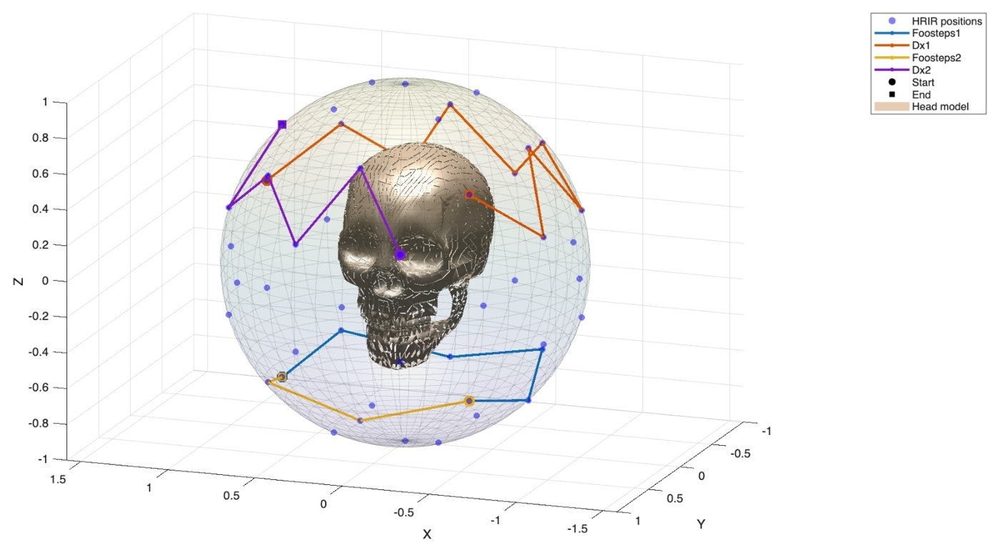
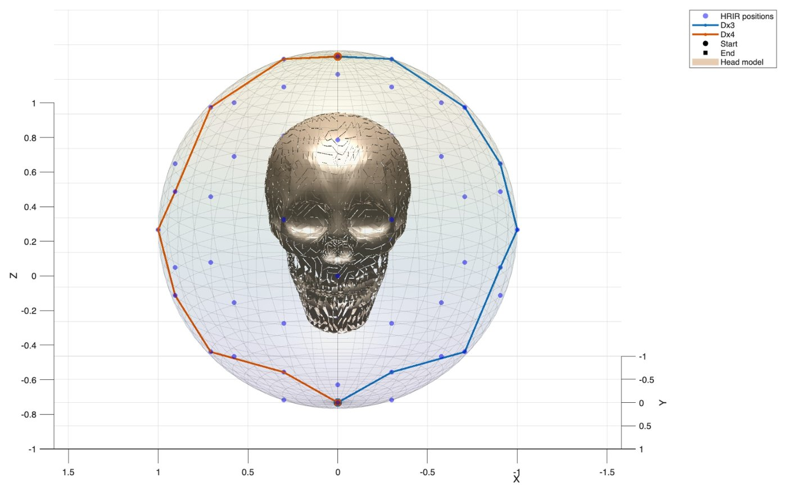
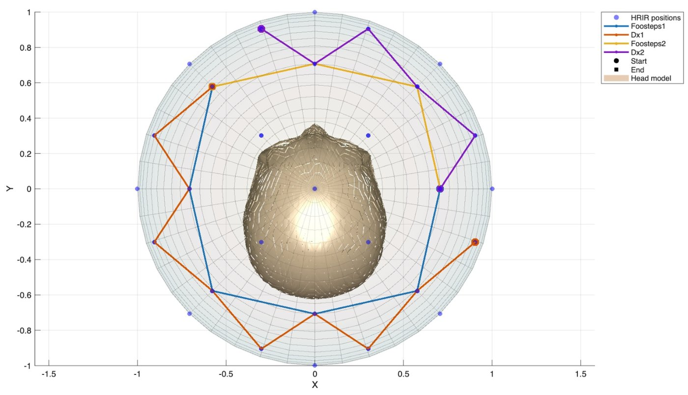
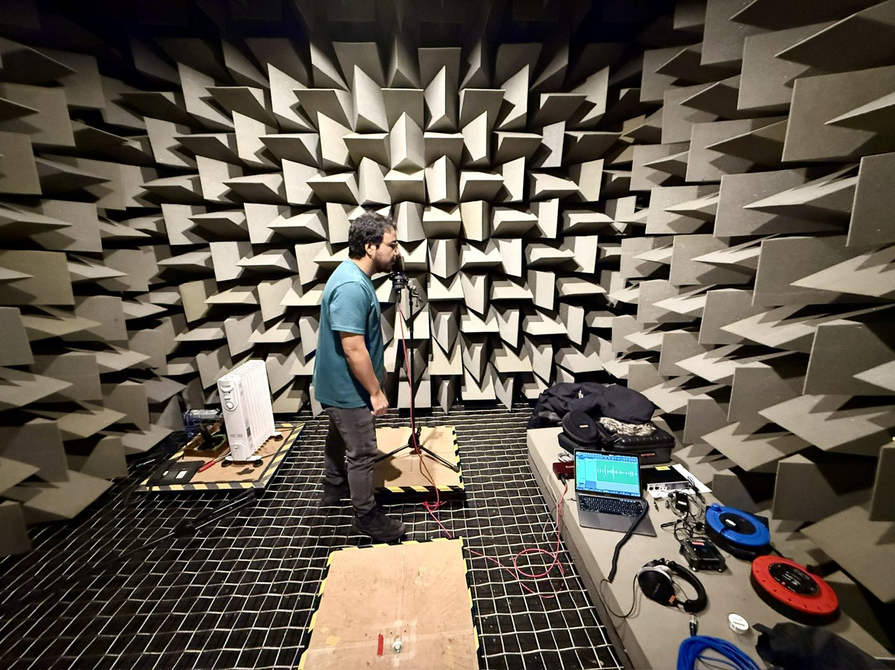

# Binaural Rendering & Virtual Pitch – MATLAB demos

Two demonstrations from the module *Audio Signals and Psychoacoustics* (MSc Audio and Music Technology, University of York, 2025–26).

---

## 1. Binaural radio drama – static and dynamic binaural rendering

🎧 **Listen with headphones:** [`binaural/render/BinauralRadioDrama.wav`](binaural/render/BinauralRadioDrama.wav) (30 s)

A door opens behind you, an old man greets you and walks a full circle around you, footsteps and all, a vintage radio switches on to your left, and a final voice flies overhead from left to right. Every source is placed or moved in **azimuth and elevation** using binaural impulse responses from the **SADIE II** database (subject H19, 50 measured directions).

| Footsteps & dialogue around the head | Voice passing overhead |
|---|---|
|  |  |
| **Top-down view** | **Recording the overhead voice (anechoic chamber)** |
|  |  |

| Part | What it does | File |
|---|---|---|
| Static renderer | One-shot convolution with the nearest measured response for fixed sources (room tone, radio) | `Functions/static_renderer.m` |
| Dynamic renderer | Block-based, time-varying convolution with **overlap-add** (1024-sample Hann frames, 50 % overlap), plus first-order smoothing between successive responses (α = 0.1) to avoid stepping artefacts | `Functions/dynamic_renderer.m` |
| Trajectories | Frame-wise az/el paths between endpoints | `Functions/trajectory.m` |
| Direction selection | Nearest measured direction by great-circle (haversine) distance | `Functions/closestHRIR.m`, `haversine.m` |
| Effects before spatialisation | Exponential soft-clip distortion, FIR slap-back delay with alternating polarity (radio), LFO-modulated feedback flanger (overhead voice) | `Functions/distortion.m`, `delay.m`, `flanger.m` |
| Diagnostics | Impulse-response time/spectrum plots, trajectory plots on a sphere, spectrogram comparisons | `Functions/plot*.m` |

Informal listening by the author suggested stable externalisation and reliable azimuth tracking; elevation, especially below ear level, was weaker, as expected. Full write-up: [`docs/binaural_report.pdf`](docs/binaural_report.pdf).

**Run:** open `binaural/Main.m` from the `binaural/` folder. The source audio is not included (see [`binaural/Audios/README.md`](binaural/Audios/README.md) for the exact file requirements); the SADIE II responses are in `binaural/SADIE_HRIRs/`. The trajectory plot expects a head mesh `Functions/skull.obj` (any triangulated Wavefront .obj; not included).

---

## 2. When the fundamental is missing – virtual pitch explorer

An interactive MATLAB tool (menu-driven) that stress-tests pitch perception theories with six cases:

| Case | Condition | Listen |
|---|---|---|
| 1 | Square wave, with vs. without f0 | [wav](virtual-pitch/audio_examples/Square_Full__Square_Missing_Fundamental.wav) |
| 2 | Sawtooth, with vs. without f0 | [wav](virtual-pitch/audio_examples/Sawtooth_Full__Sawtooth_Missing_Fundamental.wav) |
| 3 | High-frequency limits (5–10 kHz) | [wav](virtual-pitch/audio_examples/HighFreq_Full__HighFreq_Missing_Fundamental.wav) |
| 4 | F2-dominant (f0 removed, upper harmonics attenuated) | [wav](virtual-pitch/audio_examples/Sawtooth_Full__Sawtooth_F2_Dominant_Attenuated_Harmonics.wav) |
| 5 | Inharmonic shift of all partials | [wav](virtual-pitch/audio_examples/Reference_Harmonic__Inharmonic_Shifted.wav) |
| 6 | A melody where every note gets a random spectral condition | [wav](virtual-pitch/audio_examples/Imperial_March__Virtual_Pitch.wav) |

Cases 1–5 plot A/B spectrograms on a shared 0 dB reference plus magnitude spectra; case 6 plots the melody's spectrogram. Discussion of temporal vs. pattern-recognition theories: [`docs/virtual_pitch_report.pdf`](docs/virtual_pitch_report.pdf).

**Run:** open `virtual-pitch/Main.m` from the `virtual-pitch/` folder and pick a case from the menu. Exports are saved to `virtual-pitch/audio_examples/`.

**Requirements (both demos):** MATLAB R2022a or later with Signal Processing Toolbox.

---

**Author:** Andrés Felipe Berrío Cartagena – [portfolio](https://felipebc.github.io) · [LinkedIn](https://www.linkedin.com/in/felipe-berr%C3%ADo-20445630a/)

**Credits:** binaural responses from the SADIE II database (C. Armstrong, L. Thresh, D. Murphy, G. Kearney, "A Perceptual Evaluation of Individual and Non-Individual HRTFs: A Case Study of the SADIE II Database", *Applied Sciences* 8(11):2029, 2018, doi:10.3390/app8112029). The renderers, `delay.m` and `flanger.m` are adapted from teaching code by Dr Frank Stevens (University of York); `distortion.m` is adapted from *DAFX* (Zölzer, 2011).

**License:** my code is MIT-licensed (`LICENSE`); third-party data, code and audio are listed in [`NOTICE.md`](NOTICE.md).
